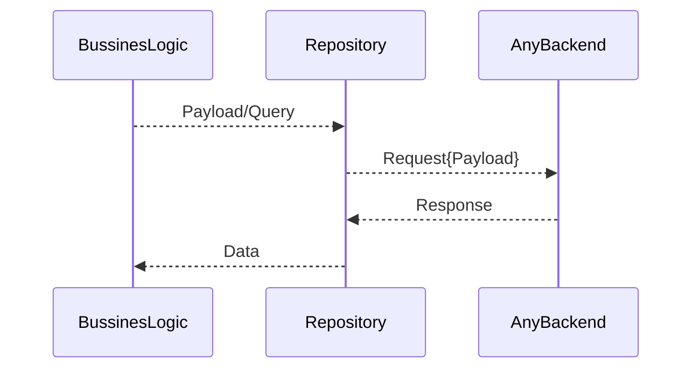

# API Managements

## Approach #1 repository design pattern

```mermaid
    sequenceDiagram
        participant BussinesLogic
        participant Repository
        participant AnyBackend
        BussinesLogic-->>Repository: Payload/Query
        Repository-->>AnyBackend: Request{Payload}
        AnyBackend-->>Repository: Response
        Repository-->>BussinesLogic: Data
```